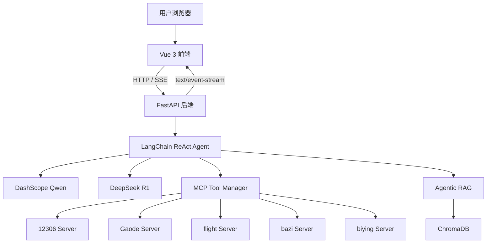
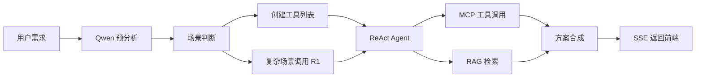
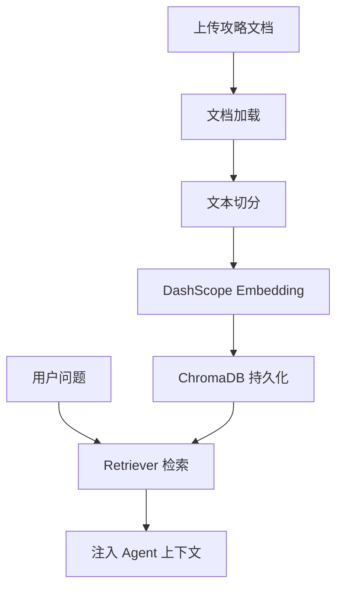

# 小桃旅游助手架构说明

## 1. 项目定位

小桃旅游助手是一个面向旅行规划场景的 Agentic AI 原生应用。系统以自然语言需求为入口，结合 DashScope/Qwen、DeepSeek R1、LangChain ReAct Agent、MCP 工具协议和 ChromaDB 向量数据库，为用户生成交通、天气、住宿、行程和预算建议。

项目方向为 **方向一：Agentic AI 原生开发**。系统重点不是单次大模型问答，而是通过 Agent 编排多个外部工具与本地知识库，形成可部署、可观测、可扩展的工程闭环。

## 2. 总体架构

系统采用分层设计：

| 层次 | 技术 | 职责 |
|------|------|------|
| 前端层 | Vue 3, Vite, TypeScript, Pinia | 对话、文档上传、状态时间线、工具状态展示 |
| API 层 | FastAPI, Pydantic, SSE | 健康检查、聊天、文档上传、流式响应 |
| Agent 层 | LangChain ReAct Agent | 需求预分析、工具选择、多步骤推理、答案合成 |
| 工具层 | MCP, LangChain Tool | 火车票、高德地图、天气、酒店、航班、黄历、搜索 |
| RAG 层 | ChromaDB, Retriever | 攻略文档索引、向量检索、知识增强 |
| 部署层 | Docker, Nginx, Docker Compose | 前端托管、API 反向代理、云服务器部署 |

## 3. 前端设计

前端位于 `src/frontend`，采用“旅行任务舱”风格界面。

- `TravelDesk.vue`：主工作台，组织聊天区、侧边控制面板和状态区。
- `ChatComposer.vue`：输入用户旅行需求。
- `MessageBubble.vue`：展示用户消息与 Agent 回答。
- `StatusTimeline.vue`：展示 Agent 执行事件，例如需求分析、R1 推理、工具查询、方案完成。
- `ControlPanel.vue`：提供攻略文档上传、最大迭代次数配置、工具状态和 RAG 文档统计。
- `api/client.ts`：封装 `/api` 请求与 SSE 流式聊天。

前端在生产环境中不直接访问后端容器地址，而是统一请求 `/api`，由 Nginx 反向代理到 FastAPI。

## 4. 后端 API

后端位于 `src/backend`，基于 FastAPI 提供接口：

| API | 方法 | 功能 |
|-----|------|------|
| `/api/health` | GET | 健康检查 |
| `/api/tools` | GET | 返回工具列表、MCP 状态、RAG 文档数量 |
| `/api/documents/upload` | POST | 上传 TXT、MD、PDF、CSV 攻略文档并构建向量索引 |
| `/api/chat` | POST | 同步聊天接口 |
| `/api/chat/stream` | POST | SSE 流式聊天接口 |

`/api/chat/stream` 是主要交互入口。后端会将 Agent 执行过程拆分为 `status`、`analysis`、`final` 和 `error` 事件，前端实时展示。

## 5. Agent 编排流程

`AgentService` 是系统核心服务，主要流程如下：

系统会先提取目的地、出发地、预算、天数、日期和偏好，然后判断是否属于复杂约束或多目的地场景。复杂场景会优先调用 DeepSeek R1 进行深度分析，随后继续执行交通、天气、住宿、黄历、航班和攻略检索。

## 6. MCP 工具设计

工具注册由 `src/aggentic_RAG/travel_agent/tools/tool_registry.py` 统一维护。

| 工具 | MCP Server | 远端工具 | 作用 |
|------|------------|----------|------|
| `train_query` | `12306 Server` | `get-tickets` | 查询火车票并结合自驾路线对比 |
| `gaode_weather` | `Gaode Server` | `maps_weather` | 查询天气 |
| `gaode_hotel_search` | `Gaode Server` | `maps_text_search` | 搜索酒店和民宿 |
| `gaode_poi_search` | `Gaode Server` | `maps_text_search` | 搜索景点、餐厅和 POI |
| `gaode_driving` | `Gaode Server` | `maps_direction_driving` | 查询驾车路线 |
| `flight_query` | `flight Server` | `search_flight` | 查询国内航班 |
| `lucky_day` | `bazi Server` | `getChineseCalendar` | 查询黄历宜忌 |
| `rag_search` | 本地 ChromaDB | Retriever | 检索攻略文档 |

系统对远端工具异常进行了兜底处理。例如：

- 航班工具根据真实 MCP schema 修正为 `search_flight`。
- 黄历服务超时时返回可读提示。
- 12306 远端异常时提示可能为日期超出查询范围或服务暂不可用。

## 7. RAG 数据流

RAG 支持 TXT、MD、PDF、CSV 等格式。用户上传攻略后，系统将文档转为向量并持久化到 ChromaDB。Agent 可通过 `rag_search` 查询本地攻略内容，用于增强景点、美食、游玩时间等回答。

## 8. Docker 与云端部署

Docker 部署包含两个主要服务：

| 服务 | 镜像/容器 | 职责 |
|------|-----------|------|
| frontend | Nginx + Vue dist | 托管前端静态文件，反向代理 `/api` |
| backend | Python + Uvicorn | 运行 FastAPI、Agent、MCP、RAG |

生产环境中：

- 前端暴露 `80` 端口。
- 后端绑定 `127.0.0.1:8000`，不直接暴露公网。
- Nginx 将 `/api` 请求代理到 `backend:8000`。
- ChromaDB 数据使用 Docker volume 持久化。

云端访问地址：`http://175.178.129.222`。

## 9. 扩展方向

- 接入 HTTPS、域名和 CI/CD 自动部署。
- 增加 LangSmith 或自建 Tracing，记录 Agent 调用链路。
- 构建 Benchmark 测试集，统计工具调用成功率、平均响应时间和人工评分。
- 引入多智能体协作，将交通、住宿、天气、预算拆分为专职 Agent。
- 增加长期记忆，记录用户常用出发地、预算偏好和住宿偏好。
